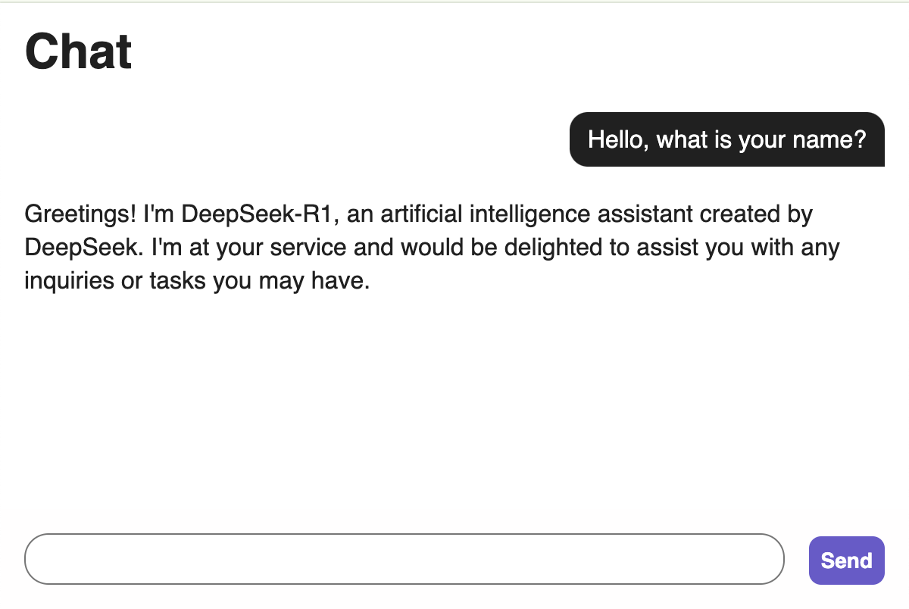

# ollama-server

An HTTP server/client with Ollama backend.

## Getting started

This project requires the following third-party software and a model.

- Ollama
- deepseek-r1:1.5b
- MongoDB (optional)

If your machine is capable, consider pulling models with a larger number of
parameters: 7b, 8b, 14b, 32b, 70b, 671b, or the full R1 model.

### Prerequisites

- Homebrew
- Node.js
- NPM

### Install and run Ollama with DeepSeek

Ollama is an open-source framework for running large language models (LLMs)
locally on your machine without relying on cloud-based APIs. It allows you to
load and run AI models, supporting features like streaming responses via HTTP.
Ollama is sessionless by default; each API call to ollama.chat does not
maintain conversation history.

```
brew install ollama
ollama serve
ollama pull deepseek-r1:1.5b
```

The Ollama server listens on port 11434. You can change this by setting the
environment variable `OLLAMA_HOST`.

Learn more at [Ollama FAQ](https://github.com/ollama/ollama/blob/main/docs/faq.md)

### Install and run MongoDB

MongoDB is a NoSQL database that stores data in JSON-like documents. In this
project, we use it to store and retrieve conversation history for maintaining
chat context.

```
brew tap mongodb/brew
brew update
brew install mongodb-community@8.0
brew services start mongodb/brew/mongodb-community
```

The MongoDB server listens on port 27017.

## Start the frontend and backend servers

Run the following command:

```
npm run start
```

## Access the UI

Visit:

http://localhost:8080

<picture>
  <source
    srcset="docs/images/conversation-dark.png"
    media="(prefers-color-scheme: dark)">
  
</picture>
